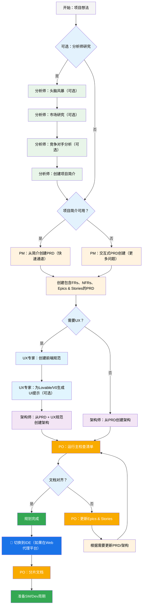
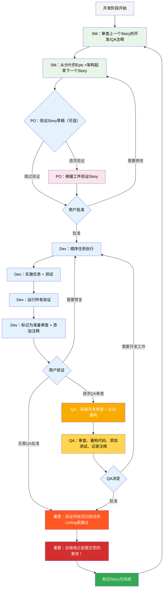

# BMad-Method BMAd Code 用户指南

本指南将帮助您理解和有效使用 BMad 方法进行敏捷AI驱动的规划和开发。

## BMad 计划和执行工作流程

首先，这是完整的标准绿地项目（Greenfield）规划+执行工作流程。棕地项目（Brownfield）非常相似，但建议先理解这个绿地项目流程，即使在处理棕地项目之前，先在一个简单项目上实践。BMad 方法需要安装到您的新项目文件夹的根目录。对于规划阶段，您可以选择使用强大的网络代理来完成，可能会以更低的成本获得更高质量的结果，而不是在某些代理工具中提供您自己的API密钥或积分。对于规划，强大的思考模型和更大的上下文——以及与代理作为合作伙伴工作将获得最佳结果。

如果您要在棕地项目（现有项目）中使用 BMad 方法，请查看 **[在棕地项目中工作](./working-in-the-brownfield.md)**。

如果您看不到下面渲染的图表，可以将 Markdown All in One 和 Markdown Preview Mermaid Support 插件安装到 VSCode（或其分支克隆版本）。使用这些插件，如果在打开时右键单击标签页，应该会有打开预览的选项，或者查看IDE文档。

### 规划工作流程（Web UI 或强大的IDE代理）

在开发开始之前，BMad 遵循结构化的规划工作流程，为提高成本效益，最好在Web UI中完成：



#### Web UI 到IDE的转换

**关键转换点**：一旦PO确认文档对齐，您必须从Web UI切换到IDE以开始开发工作流程：

1. **复制文档到项目**：确保 `docs/prd.md` 和 `docs/architecture.md` 在您项目的docs文件夹中（或您可以在安装期间指定的自定义位置）
2. **切换到IDE**：在您首选的Agentic IDE中打开您的项目
3. **文档分片**：使用PO代理对PRD进行分片，然后对架构进行分片
4. **开始开发**：开始接下来的核心开发周期

### 核心开发周期（IDE）

一旦规划完成并且文档已分片，BMad 遵循结构化的开发工作流程：



## 安装

### 可选

如果您想在Web中使用Claude（Sonnet 4或Opus）、Gemini Gem（2.5 Pro）或自定义GPT进行规划：

1. 导航到 `dist/teams/`
2. 复制 `team-fullstack.txt`
3. 创建新的Gemini Gem或CustomGPT
4. 上传文件并说明："您的关键操作说明已附加，不要按照指示打破角色"
5. 输入 `/help` 查看可用命令

### IDE项目设置

```bash
# 交互式安装（推荐）
npx bmad-method install
```

## 特殊代理

有两个bmad代理——将来它们将合并到单一的bmad-master中。

### BMad-Master

这个代理可以执行所有其他代理可以执行的任何任务或命令，除了实际的story实施。此外，这个代理可以在Web中通过访问知识库向您解释BMad方法，并向您解释有关过程的任何内容。

如果您不想在开发之外在不同的代理之间切换，这个代理适合您。请记住，随着上下文的增长，代理的性能会下降，因此指示代理压缩对话并以压缩对话作为初始消息开始新对话很重要。经常这样做，最好在每个story实施后。

### BMad-Orchestrator

这个代理不应该在IDE中使用，它是一个重量级的特殊用途代理，利用大量上下文可以变形为任何其他代理。它的存在仅仅是为了促进Web包中的团队。如果您使用Web包，您将看到BMad Orchestrator的欢迎。

### 代理如何工作

#### 依赖系统

每个代理都有一个YAML部分来定义其依赖关系：

```yaml
dependencies:
  templates:
    - prd-template.md
    - user-story-template.md
  tasks:
    - create-doc.md
    - shard-doc.md
  data:
    - bmad-kb.md
```

**关键点：**

- 代理只加载他们需要的资源（精简上下文）
- 依赖关系在打包过程中自动解析
- 资源在代理之间共享以保持一致性

#### 代理交互

**在IDE中：**

```bash
# 一些IDE，比如Cursor或Windsurf，使用手动规则，所以交互使用'@'符号
@pm Create a PRD for a task management app
@architect Design the system architecture
@dev Implement the user authentication

# 一些，比如Claude Code使用斜杠命令代替
/pm Create user stories
/dev Fix the login bug
```

#### 交互模式

- **增量模式**：逐步与用户输入交互
- **YOLO模式**：最少交互的快速生成

## IDE集成

### IDE最佳实践

- **上下文管理**：只保留相关文件在上下文中，保持文件尽可能精简和专注
- **代理选择**：为任务使用适当的代理
- **迭代开发**：在小的、专注的任务中工作
- **文件组织**：保持干净的项目结构
- **定期提交**：经常保存您的工作

## 技术偏好系统

BMad通过位于`.bmad-core/data/`中的`technical-preferences.md`文件包含个性化系统——这可以帮助PM和架构师推荐您对设计模式、技术选择或您想放在这里的任何其他内容的偏好。

### 与Web包一起使用

创建自定义Web包或上传到AI平台时，包含您的`technical-preferences.md`内容，确保代理从一开始就具有您的偏好。

## 核心配置

`bmad-core/core-config.yaml`文件是一个关键配置，使BMad能够与不同的项目结构无缝工作，将来会有更多选项可用。目前最重要的是yaml中的devLoadAlwaysFiles列表部分。

### 开发者上下文文件

定义开发代理应该始终加载哪些文件：

```yaml
devLoadAlwaysFiles:
  - docs/architecture/coding-standards.md
  - docs/architecture/tech-stack.md
  - docs/architecture/project-structure.md
```

您需要通过对架构进行分片来验证这些文档是否存在，它们尽可能精简，并包含您希望开发代理始终加载到其上下文中的确切信息。这些是代理将遵循的规则。

随着您的项目增长和代码开始建立一致的模式，编码标准应该减少到只包含代理仍然犯的标准。代理将查看文件中的周围代码以推断与当前任务相关的编码标准。

## 获取帮助

- **Discord社区**：[加入Discord](https://discord.gg/gk8jAdXWmj)
- **GitHub问题**：[报告错误](https://github.com/bmadcode/bmad-method/issues)
- **文档**：[浏览文档](https://github.com/bmadcode/bmad-method/docs)
- **YouTube**：[BMadCode频道](https://www.youtube.com/@BMadCode)

## 结论

记住：BMad旨在增强您的开发过程，而不是替代您的专业知识。将其作为强大工具来加速您的项目，同时保持对设计决策和实施细节的控制。